# UnityLoginDemo

本仓库是一个 Unity 登录与联机演示项目（UnityLoginDemo），用于简单体现账号体系、云端数据串联与 Photon Fusion 联机能力。当前覆盖：邮箱注册/登录、昵称持久化、同账号单点登录（顶号），以及 Fusion **大厅 → 房间列表 → 创建/加入/快速匹配 → 进入 Play** 的完整会话流程，并在房间内完成玩家生成与昵称同步。

> 本文以仓库代码、Unity 项目设置和 `Docs/images/backend-configuration/` 中的后台/配置截图为依据（Firebase 与 Photon Dashboard 截图于 2026-07-25；中国光子云开通与 Unity `PhotonAppSettings` 区域配置截图于 2026-07-28）。文档与截图**保留** Firebase 项目 ID、示例 UID、Photon App ID 等真实配置标识，便于对照实现与后台一致性；请勿将本仓库中的密钥/服务账号私钥等凭据用于生产或二次分发。

## 快速结论

| 项目 | 实际技术选型 |
| --- | --- |
| Unity 版本 | **Unity 2022.3.62f2**。`ProjectSettings/ProjectVersion.txt` 当前记录为 `2022.3.62f2c1`。 |
| 身份认证 | Firebase Authentication，当前代码使用邮箱/密码。 |
| 数据库 | Cloud Firestore（NoSQL 文档数据库），不是 MySQL/PostgreSQL/MongoDB，也没有本地 SQL schema。 |
| 联机 | Photon Fusion **1.1.0**，连接**中国光子云**；应用名 `MultiplayerTest`，Lobbies V2、20 CCU，`FixedRegion: cn`，Name Server `ns.photonengine.cn`。登录后先入 `FusionLobby`（大厅 `arpg-v1`），以 **Shared Mode** 建房/入房/快速匹配，再网络化加载 `Play`。 |
| 前端与后端通信 | Unity 通过 Firebase Unity SDK 直连 Authentication/Firestore；通过 Fusion SDK 连**中国光子云**。没有 RESTful API、GraphQL、自建 WebSocket 服务或自建 Node.js/Python 后端。 |
| 本地运行 | 只需 Unity 与互联网连接。Firebase/Photon 均为云端托管服务，因此没有 Docker Compose、数据库容器或后端进程需要启动。 |
| 当前环境标识 | Firebase 项目 `UnityTest`（`unitytest-8f8bd` / `413352915978`），Android 包名 `com.MyCompany.LoginDemo`；Photon AppIdFusion `d0a9f4b7-b699-4fc1-838a-6c1cacb362ed`。示例 Firestore 文档 UID：`8mP7vbUBTEelbBCvHFK2mas3auh2`。 |

## 系统架构


可在 draw.io/diagrams.net 中编辑源文件：[system-architecture.drawio](Docs/images/backend-configuration/system-architecture.drawio)。

1. Unity 登录界面将邮箱与密码交给 `FirebaseAuthManager`，由 Firebase Authentication 完成注册或登录。
2. 登录成功后，`AuthController` 生成新的会话 ID，并通过 `ForceAcquireAsync` 覆盖 Firestore `Users/{uid}` 的在线会话。
3. 同 UID 的旧客户端以 **Firestore `Listen` 为主要检测**（`activeSessionId` 被覆盖即踢下线）；**每 3 秒心跳为兜底**（`HeartbeatAsync` 返回 `Replaced` 时同样踢下线）。被踢后退出 Fusion、清除 Firebase 登录态并返回 `LoginMenu`。
4. 昵称档案就绪后进入 `FusionLobby`；`FusionSessionCoordinator` 作为唯一 Runner 管理者，先 `JoinSessionLobby(Shared, "arpg-v1")` 拉取公开房间列表，再由 UI 触发创建、指定加入或快速匹配。
5. 建房/入房成功后，Coordinator 以 `GameMode.Shared` 启动会话，并通过 `NetworkSceneManagerDefault` 网络化加载 `Play`；`PlayerSpawner` 在场景加载完成后为本机生成玩家，`NetworkPlayer` 通过 RPC 将 Firestore 昵称写入网络状态。
6. 离房时 `LeaveToLobbyAsync` 依次关闭 Runner、释放 Firestore 租约、重新 `ForceAcquireAsync` 获取新 sessionId，再回大厅；租约抢占失败则登出并返回 `LoginMenu`。
7. Fusion 将实时房间与状态同步交给**中国光子云**（`cn`）。它与 Firestore 的档案/会话数据是两条独立链路。

## 项目结构

```text
Assets/FireBase+Photon/
├─ Scenes/
│  ├─ LoginMenu.unity             # 启动场景
│  ├─ FusionLobby.unity           # 登录后大厅（房间列表与建房/入房）
│  └─ Play.unity                  # 网络化加载的联机玩法场景
└─ Scripts/
   ├─ Auth/
   │  ├─ Domain/                  # 认证/会话相关模型
   │  ├─ Application/             # 登录、注册、昵称与流程编排
   │  ├─ Infrastructure/
   │  │  ├─ Firebase/             # Firebase 初始化与邮箱认证
   │  │  └─ Firestore/            # 档案和会话数据访问
   │  ├─ Networking/              # Firestore 会话与 Fusion 生命周期桥接
   │  └─ View/
   │     ├─ Login/                # 登录/注册表单与绑定
   │     ├─ Profile/              # 昵称面板
   │     └─ Shared/               # Loading 等共用 UI
   ├─ Networking/Lobby/           # FusionSessionCoordinator、大厅 UI、房间规则
   ├─ Player/Network/             # Fusion 玩家生成、网络昵称
   ├─ GameFlow/                   # LoginMenu / FusionLobby / Play 场景切换
   └─ Tests/Editor/               # EditMode 单元测试（房间规则、快照、Spawner）
```

构建场景已在 `ProjectSettings/EditorBuildSettings.asset` 中启用，顺序是 `LoginMenu`、`FusionLobby`、`Play`。`LoginMenu` 是本机运行的入口。

## 数据库与后端

### Cloud Firestore

本项目使用 Cloud Firestore 的默认数据库。它是 Firebase 托管的文档型 NoSQL 数据库，客户端通过 Firebase Unity SDK 直接访问，而非经过自建 API。

当前代码使用的集合与字段如下：

```text
Users/{uid}
├─ name: string
├─ activeSessionId: string
├─ sessionOnline: bool
└─ sessionHeartbeatUnix: number
```

- `FirestoreUserProfileRepository` 只读写 `Users/{uid}.name`，写入使用 `SetOptions.MergeAll`，不会覆盖未来新增的字段。
- `FirestoreAuthSessionRepository` 维护 `activeSessionId`、在线状态与 Unix 时间戳心跳；新端登录直接 `ForceAcquireAsync` 覆盖会话。
- `AuthSessionGuard` 同时启动 Firestore **`ListenSession`（主路径）** 与 **每 3 秒 `HeartbeatAsync`（兜底）**；任一路径发现 `activeSessionId` 已被其他端覆盖时，本端退出 Fusion、清除 Firebase 登录态并返回 `LoginMenu`。
- 桌面版 Firestore 本地持久化已在 `FirestoreClient` 明确关闭（`PersistenceEnabled = false`），以回避该 SDK 在 Windows Standalone 上的原生稳定性问题。

### Firestore 安全规则

当前后台截图及项目设计对应的规则是：用户只能访问自己 UID 对应的文档。

```javascript
rules_version = '2';

service cloud.firestore {
  match /databases/{database}/documents {
    match /Users/{uid} {
      allow read, write: if request.auth != null && request.auth.uid == uid;
    }
  }
}
```

此规则适用于本项目目前的直连 BaaS 结构。它防止 A 用户读写 B 用户的档案，但不会把客户端变成可信服务器：用户仍可写自己的允许字段。排行榜、付费、货币发放、反作弊等高价值逻辑必须迁移至可信服务端（例如 Cloud Functions/Cloud Run 或自建后端）后再开放。

### 为什么没有后端启动命令

仓库没有 `docker-compose.yml`、SQL migration、Node.js `package.json` 或 Python 服务入口。运行时依赖的是 Firebase 与 Photon Cloud 的托管服务，因此：

- 不需要启动 MySQL/PostgreSQL/MongoDB；
- 不需要启动 REST、GraphQL 或 WebSocket 后端；
- 不存在可在 Unity Inspector 中改写的 `Server URL`；
- 本地离线时，注册、登录、Firestore 档案和 Photon 联机都会失败或不可用。

## Fusion 大厅与房间（关键细节）

本节提炼自 commit `0415c8c` 及 [`Docs/FusionLobbyRoomTechnicalPlan.md`](Docs/FusionLobbyRoomTechnicalPlan.md)。完整设计、权限分层与后续迁移路线见该文档。

### 会话流程与状态机

```text
登录 + 昵称档案就绪
  -> FusionLobby（FusionSessionCoordinator 自动 JoinLobbyAsync）
  -> JoinSessionLobby(SessionLobby.Shared, "arpg-v1")
  -> OnSessionListUpdated -> FusionLobbyService -> 房间列表 UI
  -> 创建房间 / 加入指定房间 / 快速匹配
  -> StartGame(Shared, SessionName, Scene=Play, SceneManager)
  -> OnSceneLoadDone -> PlayerSpawner.EnsureLocalPlayerSpawned
  -> Play 内「Leave room」-> LeaveToLobbyAsync -> 回 FusionLobby
```

`FusionSessionState` 覆盖 `Idle`、`ConnectingLobby`、`Lobby`、`JoiningRoom`、`InRoom`、`Leaving`、`Error`。异步操作通过 `_operationInProgress` 防重复提交。

### Runner 唯一性与 Play 场景变更

- **唯一 Runner 入口**：只有 `FusionSessionCoordinator` 可创建、启动或关闭 `NetworkRunner`；UI（`FusionLobbyView`、`FusionRoomLeaveView`）只调用 Coordinator 的 `JoinLobbyAsync`、`CreateRoomAsync`、`JoinRoomAsync`、`QuickMatchAsync`、`LeaveToLobbyAsync`。
- **移除自动 Bootstrap**：`Play` 场景不再使用 `FusionBootstrap` 自动 `StartGame`；Runner 在 Coordinator 内动态创建，并挂载 `FusionLobbyService`、`FusionAuthSessionBridge`、`NetworkSceneManagerDefault` 与输入回调。
- **网络化场景加载**：建房/入房时 `StartGameArgs.Scene` 指向 Build Settings 中的 `Play`，由 `INetworkSceneManager` 加载，而非 `GameSceneController` 直接切场景。

### 房间模型与规则

| 项 | 当前实现 |
| --- | --- |
| 大厅名 | 固定 `arpg-v1`（`FusionSessionCoordinator.LobbyName`） |
| 游戏模式 | 首期统一 `GameMode.Shared` |
| 房间上限 | 4 人（`FusionRoomRules.MaxPlayers`） |
| 房间名 | 最长 24 字符；仅字母、数字、`.`、`-`、`_` |
| 会话属性 | `map`、`difficulty`、`phase`、`build`（均为公开短字段；禁止放 Firebase UID、令牌或背包等可信数据） |
| 默认建房属性 | `map=play`、`difficulty=normal`、`phase=waiting`、`build=Application.version` |
| 快速匹配 | `SessionName=null`，并按 `map=play`、`phase=waiting`、`build=当前版本` 筛选 |
| 列表展示 | `LobbyRoomSnapshot`；`CanJoin` = 可见且开放且未满员 |

创建房间时 `EnableClientSessionCreation=true`；加入指定房间时为 `false`，房间不存在则失败并提示，不隐式建房。

### 认证租约与离房重入

- 入大厅前 `EnsureAuthLeaseAsync`：若 `AuthSessionGuard` 未激活，则生成新 `sessionId` 并 `ForceAcquireAsync`，再 `AuthSessionGuard.Begin`。
- 离房 `LeaveToLobbyAsync`：`AuthSessionGuard.EndAsync` → `Shutdown` Runner → 再次 `ForceAcquireAsync` 获取新租约 → 加载 `FusionLobby` 并重新入大厅。
- 租约获取失败：Firebase 登出、清空 `UserSession`、返回 `LoginMenu`。**不能**带着已释放的旧 `sessionId` 重连。
- `FusionAuthSessionBridge` 仍负责断线/Shutdown 时释放租约；新增大厅流程不得绕过它。

### 玩家生成与昵称

- `PlayerSpawner` 在 Shared 下仅为**本机** `LocalPlayer` 生成角色（`NetworkSpawnFlags.SharedModeStateAuthLocalPlayer`）；`IPlayerLeft` 时由 State Authority 显式 `Despawn`。
- `NetworkPlayer`：`InputAuthority` 通过 `RPC_RequestDisplayName` 请求展示名，`StateAuthority` 校验 `info.Source == InputAuthority` 后写入 `[Networked] PlayerName`。
- 场景加载完成后由 Coordinator 调用 `EnsureLocalPlayerSpawned`，弥补网络化加载与 `IPlayerJoined` 时序差异。

### 权限分层（首期 Shared）

Input Authority 只表达输入意图；State Authority 才能写入位置、昵称等网络状态；UI 不直接决定游戏结果。Shared 下 `Runner.IsSharedModeMasterClient` 用于房间元数据协调，不等同于所有网络对象的 State Authority。各 `GameMode` 的权威矩阵与后续 Host/Server 迁移路线见 [`Docs/FusionAuthorityModeFlow.drawio`](Docs/FusionAuthorityModeFlow.drawio) 与技术方案文档。

### EditMode 测试

`Assets/FireBase+Photon/Tests/Editor/` 包含 `FusionRoomRulesTests`、`LobbyRoomSnapshotTests`、`PlayerSpawnerLifecycleTests`，覆盖房间名校验、快照 `CanJoin` 逻辑与 Spawner 生命周期约定。

## 技术文档索引

`Docs/` 目录记录认证、联机与会话设计的方案与审查结论。编写或修改 README 时优先对照下列文档与源码。

| 文档 | 用途 |
| --- | --- |
| [`Docs/FusionLobbyRoomTechnicalPlan.md`](Docs/FusionLobbyRoomTechnicalPlan.md) | **大厅与房间主方案**：会话流程、`FusionSessionCoordinator` 职责、房间模型、`GameMode` 权威矩阵、Fusion v1 编码规范、实施顺序与验收标准 |
| [`Docs/FusionAuthorityModeFlow.drawio`](Docs/FusionAuthorityModeFlow.drawio) | Shared / Host / Server / Client 各层权限流图（draw.io 源文件） |
| [`Docs/AuthNetworkTechnicalPlan.md`](Docs/AuthNetworkTechnicalPlan.md) | Firebase Auth、Firestore 档案/租约与 Fusion 的职责边界、目标状态流与渐进重构顺序（短版） |
| [`Docs/AuthNetworkCodeReview.md`](Docs/AuthNetworkCodeReview.md) | 认证联机链路代码审查：P1–P3 发现项、移除/迭代计划与验证缺口 |
| [`Docs/AGENTS.md`](Docs/AGENTS.md) | `Docs/` 目录写作约定：事实依据、术语一致性与轻量修改原则 |

说明：`FusionLobbyRoomTechnicalPlan.md` 撰写时部分示例仍引用 `hk` 区域与 `FusionBootstrap` 自动启动；当前仓库已切换中国光子云 `cn`，且 `Play` 已改为 Coordinator 手动管理 Runner。以 README 与本节「Runner 唯一性」描述为准。

## 通信机制

| 链路 | 协议/SDK | 用途 | 配置位置 |
| --- | --- | --- | --- |
| Unity -> Firebase Authentication | Firebase Unity SDK | 邮箱/密码注册与登录、登出 | `Assets/google-services.json`、`Assets/StreamingAssets/google-services-desktop.json` |
| Unity -> Cloud Firestore | Firebase Unity SDK | `Users/{uid}` 档案、会话 Listen、心跳兜底 | 同上，以及 Firebase Console 的 Firestore 规则 |
| Unity -> 中国光子云 | Photon Fusion SDK | Session Lobby（`arpg-v1`）、建房/入房、网络化加载 `Play`、实时玩家状态与昵称同步（`FixedRegion: cn`） | `Assets/Photon/Fusion/Resources/PhotonAppSettings.asset` |
| Fusion 断线/离房 -> Firestore | 本地 C# 桥接 | 断线或离房后释放在线会话；离房重入须重新 `ForceAcquireAsync` | `FusionAuthSessionBridge.cs`、`FusionSessionCoordinator.cs`、`AuthSessionGuard.cs` |

当前联机实现使用 Fusion。`Assets/Photon/PhotonUnityNetworking/Resources/PhotonServerSettings.asset` 是 PUN 的独立设置资源；不要用它替代 Fusion 的 `PhotonAppSettings.asset`。Fusion 设置当前走**中国光子云**：`UseNameServer` 启用、`FixedRegion` 为 `cn`、`Server` 为 `ns.photonengine.cn`，未填写自建 Photon Server 地址。

Firebase Console 的截图显示 **Google** 登录提供方已启用，但当前仓库的 `FirebaseAuthManager` 只调用 `CreateUserWithEmailAndPasswordAsync` 与 `SignInWithEmailAndPasswordAsync`。因此，Google 登录尚未由 Unity UI/代码接入；仅在 Console 启用不代表客户端内已经可用。

## 首次配置

### 1. 安装并打开 Unity

1. 在 Unity Hub 安装 **Unity 2022.3.62f2**，并包含目标平台的 Build Support。
2. 使用 Unity Hub 的 **Add/Open** 打开本仓库根目录。
3. 等待 Unity 导入资源和生成项目文件；不要用其它主版本打开后再提交 `ProjectSettings/ProjectVersion.txt`。
4. 如 Package Manager 报 `com.unitymcp.server` 找不到，检查 `Packages/manifest.json` 中的本地绝对路径是否在当前机器存在。该包是开发辅助工具，不是本项目的运行时后端。

### 2. 配置 Firebase

1. 打开 Firebase Console，创建或选择项目。
2. 在 **项目设置 -> 常规** 添加 Android 应用；包名必须与 Unity 的 `Project Settings -> Player -> Android -> Package Name` 完全一致。
3. 下载新的 `google-services.json`，替换 `Assets/google-services.json`；桌面目标也同步替换 `Assets/StreamingAssets/google-services-desktop.json`。
4. 在 **Authentication -> 登录方法** 启用 **电子邮件地址/密码**。这是当前代码唯一实际调用的认证方式。
5. 在 **Firestore Database** 创建默认数据库，并在 **规则** 页发布上一节的规则。
6. 首次登录后，客户端会按需创建/更新 `Users/{Firebase UID}`。不需要预先手工创建用户文档。

若未来接入 Google 登录，除启用提供方外，还需在 Unity 侧实现 Google 凭据取得与 `FirebaseAuth.SignInWithCredentialAsync` 调用，并为 Android 发布签名配置 SHA 指纹；这不属于当前代码已完成的功能。

### 3. 配置 Photon Fusion（中国光子云 / 大陆区）

本项目面向大陆联机验收，已从国际云固定香港区（`hk`）切换到**中国光子云**大陆区（`cn`）。大陆区与国际区网络隔离：仅把 `FixedRegion` 改成 `cn` 不够，还须使用已开通中国区权限的 AppId，并把 Name Server 指向 `ns.photonengine.cn`。

#### 3.1 开通中国光子云

1. 在国际 Photon Dashboard 创建 **Fusion** 应用，记下 App ID（本项目为 `d0a9f4b7-b699-4fc1-838a-6c1cacb362ed`，应用名 `MultiplayerTest`）。
2. 按中国光子云流程提交开通申请（申请表需标明 appId 类型为 Photon Fusion、填写申请人与项目简介等）。
3. 收到 `chinacloud@photonengine.cn` 的开通确认邮件后，该 AppId 即可用于中国区；开通前后 AppId 本身不变。
4. 在国际 Dashboard 中仍可查看该应用的 CCU、Lobbies 等配额；本项目当前为 Lobbies V2、20 CCU。

#### 3.2 Unity `PhotonAppSettings` 必填项

在 Unity 中打开 `Assets/Photon/Fusion/Resources/PhotonAppSettings.asset`，与当前仓库一致的配置为：

| 字段 | 当前值 | 说明 |
| --- | --- | --- |
| `AppIdFusion` | `d0a9f4b7-b699-4fc1-838a-6c1cacb362ed` | 与 Dashboard / 中国区开通邮件中的 AppId 一致 |
| `UseNameServer` | 启用 | 通过 Name Server 解析区域 Master Server |
| `FixedRegion` | `cn` | 中国大陆区（机房在上海） |
| `Server` | `ns.photonengine.cn` | 中国光子云 Name Server；国际默认 Name Server 无法稳定服务大陆流量 |
| `Port` | `0` | 使用默认端口 |
| `Protocol` | `Udp` | 与当前资源一致；可按需要启用 Protocol Fallback |

不要填写自建 `Server`/`Port` 去覆盖上述 Name Server，除非明确切换到自建 Photon Server。当前项目设计连接中国光子云，而非自建机房。

若将来面向海外玩家，应使用国际云区域（例如 `hk` / `asia` 等）并清空或改回国际 Name Server；大陆区与国际区玩家不能直接进入同一房间。

#### 3.3 区域与延迟（实测结论）

此前固定 `hk` 时，本端 RTT 约 **211 ms**，构成联机同步延迟里可预期的最大固定成本，表现上容易出现移动/动画不同步观感。切换到 `cn`（Name Server `ns.photonengine.cn`）后，区域路径成本显著下降，延迟同步问题有明显改善。

验收时请在目标网络环境下观察 Fusion 连接日志中的区域码与 RTT，确认实际落到 `cn`，而不是仍连到国际区。

### 4. 运行与验证

1. 打开 `Assets/FireBase+Photon/Scenes/LoginMenu.unity`。
2. 点击 Play，使用邮箱/密码注册一个测试账号；注册成功后按当前流程会登出并返回登录页。
3. 用该账号登录，设置昵称后应进入 `FusionLobby`，确认房间列表 UI 与状态文案正常。
4. 在一端创建房间，另一端从列表加入同一房间；双方应在网络化加载的 `Play` 中各自生成玩家并看到对方昵称。
5. 在 `Play` 点击「Leave room」，确认回到 `FusionLobby` 且可再次建房/入房。
6. 用两个 Unity Editor 实例或一个 Editor 加一个 Build 测试；可使用仓库现有的 ParrelSync 工具辅助多开。
7. 用相同账号从第二个实例登录，确认第一个实例通过 Listen（或心跳兜底）发现会话覆盖后回到登录场景。

## Unity 构建规范

项目必须使用 **Unity 2022.3.62f2** 开发与构建。每次发布前请在该版本执行：

1. `Assets -> Reimport All` 仅在依赖或导入异常时使用，平时不应作为构建步骤。
2. 打开 `LoginMenu.unity`，确认 Console 没有红色编译错误。
3. 在 `File -> Build Settings` 确认 `LoginMenu`、`FusionLobby` 与 `Play` 已勾选且顺序正确。
4. 选择目标平台后执行 Build，并在目标设备验证 Firebase 登录与 Photon 联机。

本 README 不新增第三方运行时包；现有 Firebase、Photon Fusion、TextMeshPro、Cinemachine、DOTween 与 ParrelSync 等依赖仍以仓库当前状态为准。

## 后台配置截图

以下截图均存放于仓库内的 `Docs/images/backend-configuration/`，**保留真实项目 ID、UID、Photon App ID 等标识**，便于对照 Console/Dashboard 与仓库配置的一致性。它们记录的是本项目当前环境，不是通用模板。

| 截图 | 说明 |
| --- | --- |
| 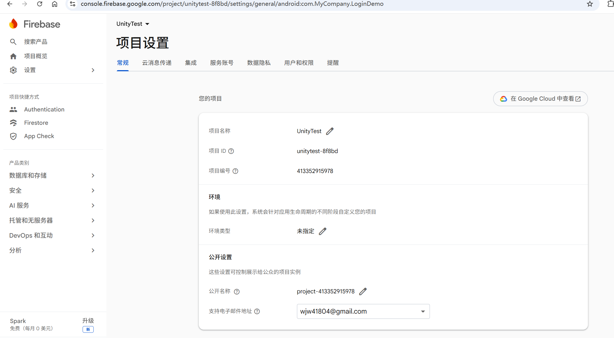 | Firebase 项目 `UnityTest` 常规设置（项目 ID / 编号可见）。 |
| 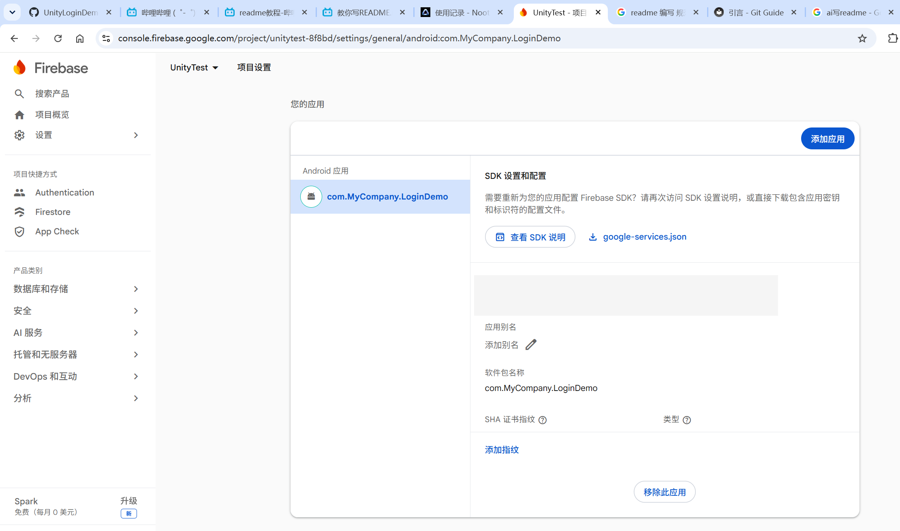 | Android 应用 `com.MyCompany.LoginDemo` 与 `google-services.json` 下载入口。 |
| 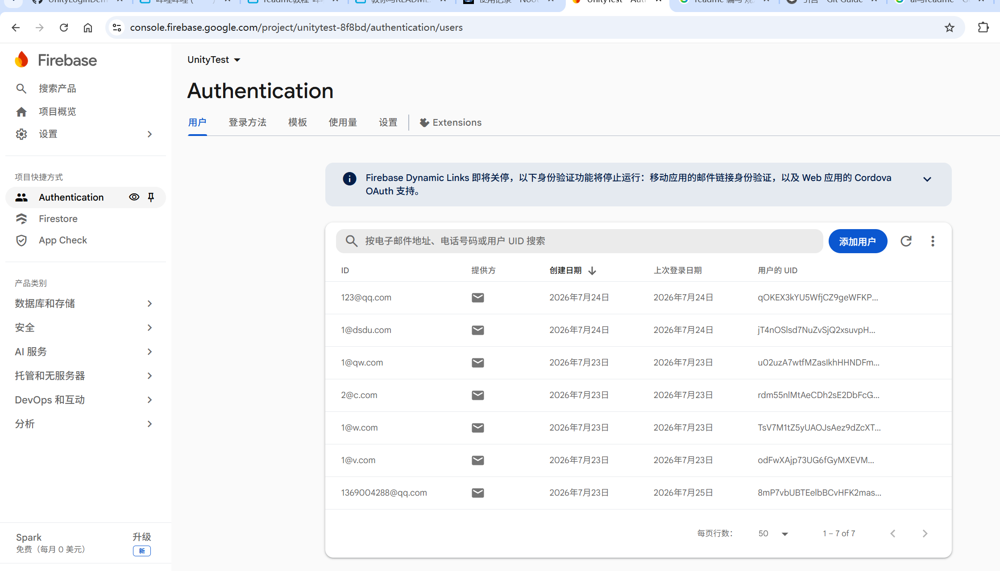 | Authentication 用户列表（邮箱与 UID 可见）。 |
| 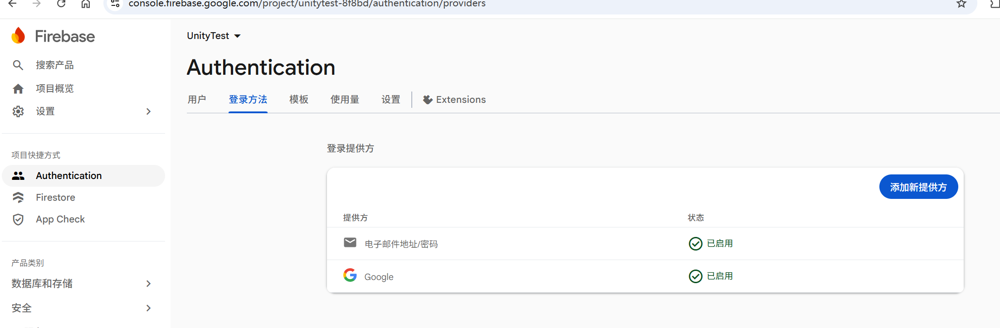 | 邮箱/密码与 Google 提供方在 Console 中已启用。 |
| 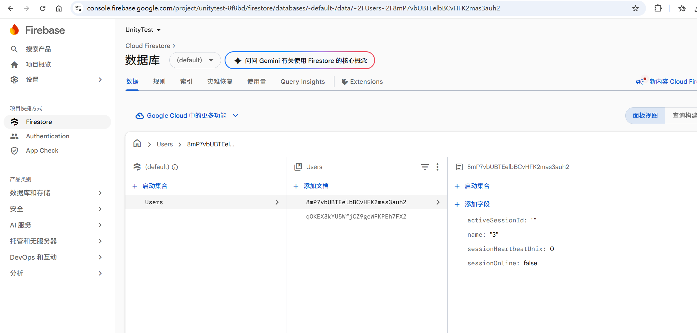 | `Users/8mP7vbUBTEelbBCvHFK2mas3auh2` 与会话字段示例。 |
| 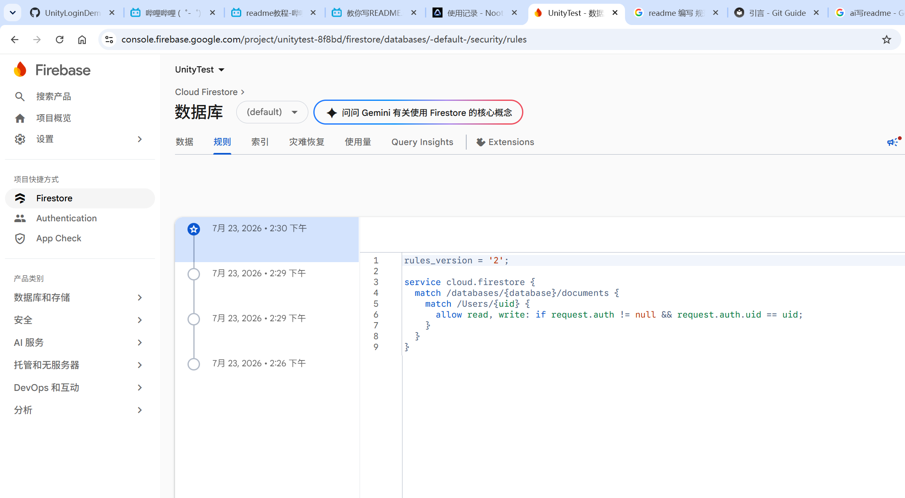 | `Users/{uid}` 的归属访问规则。 |
| 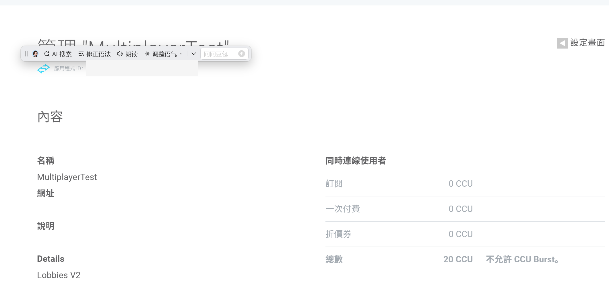 | `MultiplayerTest`：App ID、Lobbies V2 与 20 CCU。 |
| 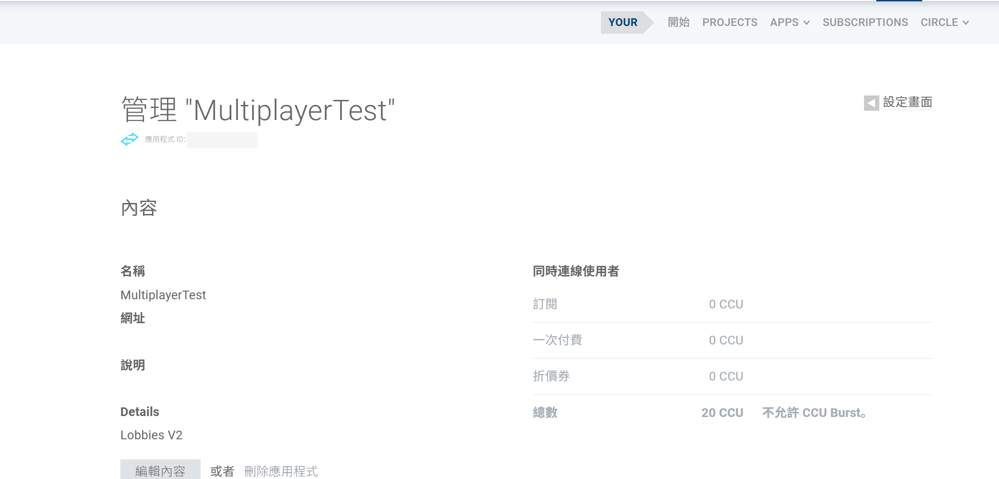 | Photon 应用详情（含 App ID）。 |
| 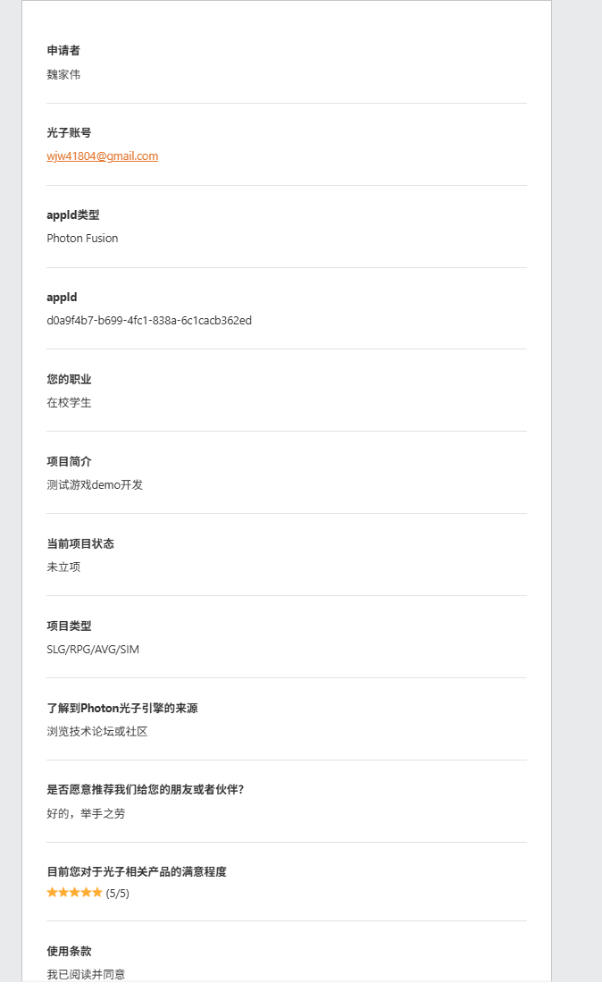 | 中国光子云开通申请：appId 类型 Photon Fusion，AppId 与仓库一致。 |
| 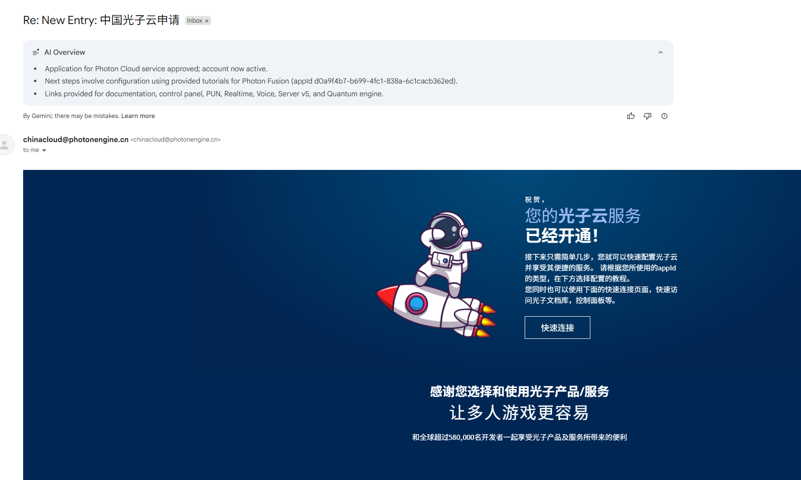 | `chinacloud@photonengine.cn` 开通确认；AppId `d0a9f4b7-b699-4fc1-838a-6c1cacb362ed`。 |
| 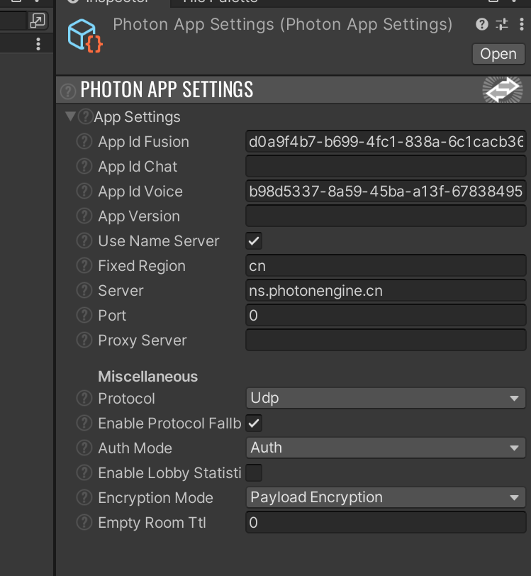 | `FixedRegion: cn`，`Server: ns.photonengine.cn`，`UseNameServer` 启用。 |

## AI 使用说明

本次文档编写与后续区域配置更新使用 AI 协助完成以下工作：梳理 Unity 工程中 Firebase/Fusion 的调用链、比对配置截图与实际资源路径、识别「已在 Console 启用但尚未由代码接入」的 Google 登录差异，并根据中国光子云开通材料与 `PhotonAppSettings` 更新大陆区（`cn`）配置说明。AI 的价值在于快速建立跨目录的架构视图、减少遗漏和重复查找。

所有结论均以仓库内的 C#、Unity 资源、项目设置和所提供截图复核后写入；AI 不替代 Firebase/Photon 帐号权限，也不直接管理线上数据或发布配置。开发者仍应在目标 Unity 版本、目标 Firebase 项目和 Photon 应用上完成实际构建与联机验收。

## 关键源码索引

### 认证与档案

- Firebase 初始化及邮箱认证：`Assets/FireBase+Photon/Scripts/Auth/Infrastructure/Firebase/FirebaseAuthManager.cs`
- Firestore 初始化与桌面持久化设置：`Assets/FireBase+Photon/Scripts/Auth/Infrastructure/Firestore/FirestoreClient.cs`
- 玩家昵称档案：`Assets/FireBase+Photon/Scripts/Auth/Infrastructure/Firestore/FirestoreUserProfileRepository.cs`
- 单点登录会话：`Assets/FireBase+Photon/Scripts/Auth/Infrastructure/Firestore/FirestoreAuthSessionRepository.cs`
- 登录后进大厅编排：`Assets/FireBase+Photon/Scripts/Auth/Application/Flow/AuthLoginFlowCoordinator.cs`
- 被顶号与 Fusion 生命周期：`Assets/FireBase+Photon/Scripts/Auth/Networking/Session/AuthSessionGuard.cs`、`Assets/FireBase+Photon/Scripts/Auth/Networking/Fusion/FusionAuthSessionBridge.cs`

### 大厅、房间与会话

- Runner 唯一管理与状态机：`Assets/FireBase+Photon/Scripts/Networking/Lobby/FusionSessionCoordinator.cs`
- 大厅列表回调与快照：`Assets/FireBase+Photon/Scripts/Networking/Lobby/FusionLobbyService.cs`
- 大厅 UI（建房/入房/快速匹配）：`Assets/FireBase+Photon/Scripts/Networking/Lobby/FusionLobbyView.cs`
- Play 内离房按钮：`Assets/FireBase+Photon/Scripts/Networking/Lobby/FusionRoomLeaveView.cs`
- 房间规则与快照模型：`Assets/FireBase+Photon/Scripts/Networking/Lobby/Core/FusionRoomRules.cs`、`LobbyRoomSnapshot.cs`
- 场景切换：`Assets/FireBase+Photon/Scripts/GameFlow/GameSceneController.cs`、`GameSceneIds.cs`

### 玩家与网络对象

- Fusion 玩家生成与清理：`Assets/FireBase+Photon/Scripts/Player/Network/PlayerSpawner.cs`
- 网络昵称（RPC 写入）：`Assets/FireBase+Photon/Scripts/Player/Network/NetworkPlayer.cs`

### 配置

- Fusion 中国光子云区域配置：`Assets/Photon/Fusion/Resources/PhotonAppSettings.asset`（`FixedRegion: cn`，`Server: ns.photonengine.cn`）
- 构建场景顺序：`ProjectSettings/EditorBuildSettings.asset`（`LoginMenu` → `FusionLobby` → `Play`）
